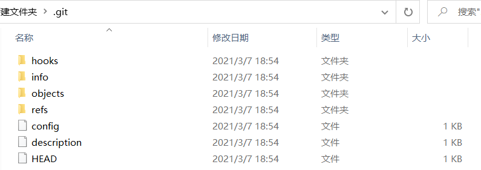

# Git的安装和使用

## 目的

通过git管理托管项目代码。版本控制管理系统（VCS），可以在任何时间点，将文档的状态记录作为更新记录保存起来，也可以在任何时间点，将更新记录恢复出来。

## 下载和安装

git官网下载：https://git-scm.com/downloads

- 安装完后打开git bash命令行窗口
- `git --version` 可以使用这条命令查看当前git版本

`默认Markdown不支持指定图片的显示大小，不过可以通过直接插入标签来指定相关属性。`  

## Git的工作区域

git有3个工作区域

- 版本库(git Repository)：最终确定的文件保存到仓库，成为一个新的版本，对他人可见。
- 暂存区：暂存已经修改的文件，最后统一提交到Git仓库中。
- 工作区(Working Directory)：添加、编辑、修改文件等动作。
  
## Git基础设置

git使用前需要先配置，使用git可以多人协作，可以做到责任分工。

1. 初始化用户名     
   `git config --global user.name 'Scripthqs'`
2. 设置用户名邮箱  
   `git config --global user.email '1941186772@qq.com'`
3. 查看设置(验证是否初始化成功)  
   `git config --list`  
4. 如果配置需要修改配置信息
   - 再重复上述的命令可以修改配置信息
   - 也可以找到`C盘-用户文件夹-.gitconfig`中的文件，该文件中修改修改配置信息

**注意：该设置在GitHub仓库主页显示谁提交了该文件。**

## 初始化一个Git仓库

1. 显示当前位置  
   `pwd`
2. 创建名为`test`的文件夹  
   `mkdir test`
3. 进入名为`test`文件夹  
   `cd test`
4. 返回上一级目录  
   `cd ..`
5. 创建名为`index.html`的文件
   `touch index.html`

**前5步的作用主要通过命令行创建文件夹和文件，熟悉命令行**

6. 在文件内初始化Git（创建Git仓库）  
   `git init`  
   文件夹中会出现一个隐藏文件夹`.git`，如图：

   - hooks：目录包含客户端或服务端的钩子脚本
   - info：包含一个全局性排除文件
   - logs：保存日志信息
   - objects：目录存储所有数据内容
   - refs：目录存储指向数据（分支）的提交对象指针
   - config：文件包含项目特有的配置选项
   - desciption：用来显示对仓库的描述信息
   - HEAD：文件指示目前被检出的分支
   - index：文件保存暂存区信息

## Git基本提交命令

- `git status` 查看当前状态
- `git add xx` 将xx文件提交到暂存区
- `git add .` 使用`.`时，代表将当前文件夹下的所有文件提交到暂存区
- `git commit -m 描述` 提交到仓库，每次提交一定要写描述
- `git log` 查看提交状态，每一次提交都会有一个唯一的提交ID

## Git的撤销

### 情况1

用暂存区的文件覆盖工作目录的文件  
- `git checkout 文件` 

### 情况2

将文件从暂存区中删除  
- `git rm --cached 文件` 

将暂存区的文件从暂存区撤出，但不会更改文件   
- `git restore --staged 文件`

这两种方法的效果区别不大

### 情况3

将git仓库中指定的更新记录恢复出来，并且覆盖暂存区和工作目录
- `git reset --hard commitID`

## Git分支

分支相当于当前工作目录的副本，使用分支，可以让我们从主线中分离出来，不同的分支可以做不同的事情，有的分支修复bug，有的分支开发新功能，避免影响开发主线。

### 分支的分类

- 主分支(master)：第一次向git仓库中提交更新记录时自动产生的分支。
- 开发分支(develop)：作为开发的分支，基于master分支创建，在实际开发中，一定要保持主分支的稳定性，开发完成后，再合并到主分支，每个分支相互独立，互不影响。
- 功能分支(feature)：作为开发具体功能的分支，基于开发分支创建。功能分支开发完成后，再合并到开发分支，开分分支功能累计后再合并到主分支。

分支可以存储各个项目版本

### 分支命令

- `git branch` 查看分支
- `git branch 分支名称` 创建分支
- `git checkout 分支名称` 切换到指定分支
- **在切换分支之前，当前分支上的工作一定要提交到git仓库中，要保证当前分支上的工作区时完全干净的状态。**
- `git merge 需要合并的分支` 合并分支，合并分支前要先切换到主分支
- `git branch -d 分支名称`删除分支，删除分支前要切换到其他分支下，分支被合并后才运行删除，`-D`可以强制删除
- 经过实验证明，主分支也能够被删除，得出结论主分支是相对的。

### 暂时保持更改

在git中，分支要先提交到仓库再切换，可以暂时提取分支上的所有改动并存储，让开发人员得到一个干净的工作副本，临时转向其他工作。

- `git stash` 存储临时改动，提取所有的改动并保存至剪切板内
- `git restore --staged 文件` 这条命令还可以将临时存储的文件撤销
- `git stash pop`恢复分支

**git提供的存储功能是独立于分支的，其他分支也可以使用这个命令，注意不要弄错分支**

## Git管理远程仓库GitHub

## 目的

借助github托管代码，备份，实现代码共享集中化管理。

## 注册github账号

官网：github.com

### Github基本概念

### 仓库(Repository)

仓库用来存放项目代码，每个项目对应一个仓库，多个开源项目则有多个仓库。

### 收藏(Star)

收藏项目，方便下次查看。

### 复制克隆项目(Fork)

复制克隆他人项目，可以添加修改代码，但只会影响自身的仓库。  
注意：**Fork的项目是独立存在的。**

### 发起请求(Pull Request)

Fork他人项目后，自己添加修改代码，发起请求，项目作者可以选择同意或拒绝请求。

### 关注(Watch)

关注项目后，可以收到该项目更新的通知消息。

### 创建项目

一个git库对应一个开源项目，通过git管理git库。新建或者导入文件。

###  修改项目

直接在项目上修改或者本地修改再上传到仓库。

### 删除项目

设置(setting)往下翻到最下面可以找到删除仓库(repository)。

### 搜索文件

点击go to file或者按快捷键T。

### 事务卡片(Issue)

发现代码BUG，但是目前没有成型代码，需讨论时用。

### Issue和Pull Request

可以点击Issue来给别人提出问题或建议，别人或自己可以选择关闭或者回答。可以通过新建Issue和Pull Request为开源项目做贡献。

### 3个页面

1. github主页
2. 仓库主页
3. 个人主页

## 多人协作的流程

1. A在自己计算机中创建本地仓库
2. A在github中创建远程仓库
3. A将本地仓库推送到远程仓库
4. B克隆远程仓库到本地进行开发
5. B将本地仓库中开发的内容推送到远程仓库
6. A将远程仓库中的最新内容拉到本地

### 将本地仓库推送到远程仓库

A创建好本地仓库和远程仓库后，将本地仓库推送到远程仓库中。

- `git push 远程仓库地址 分支名称`
- 第一次推送应该会验证github账号密码
- 然后计算机会自动保存账号密码，账号密码保存的位置
  - 打开控制面板
  - 点击右上角的查看方式设置为大图标（默认一般是类别）
  - 点击凭据管理器
  - 选择Windows凭据
  - 可以看到这个账号，删除后下次推送还会验证账号密码
远程仓库地址可以起一个方便的别名，方便推送
- `git remote add 别名 远程仓库地址`
- `git push 别名 分支名称`

这种方法还是不够方便

- `git push -u 远程仓库地址 分支名称`
- `git push -u 别名 分支名称`
- 以上两种方法选择一种，只要在push后面加上`-u`下次就可以直接通过`git push`提交代码

### 将远程仓库克隆到本地仓库

B在本地计算机中，选择一个合适的地方，打开git bash命令行窗口，将远程仓库克隆到本地。

- `git clone 远程仓库地址`
- B克隆的远程仓库依然可以使用A之前创建的别名
- B在可以在本地开发功能和提交到本地仓库
- 注意：此时B还不能直接将本地仓库推送到远程仓库中，如果可以，那么远程仓库将很可能被随意修改。

A可以github中给B权限，让B成为协作者

- 点击仓库中settings(设置)
- 左侧选择Manage access(管理访问)
- 输入账号密码验证身份
- invite a collaborator(邀请协作伙伴)
- 输入B的github账号
- 会生成一个邀请链接，A将这个链接发送给B
- B访问这个链接，并同意
- 此时B可以将本地仓库推送到远程仓库

### 将最新版本更新到本地仓库

A将最新的版本拉取到本地仓库

- `git pull 远程仓库地址 分支名称`
- `git pull 别名 分支名称`
- `git pull`也可以直接使用
- 拉取操作属于读取操作，不需要验证身份
- 如果远程仓库中的版本高于本地仓库的版本，本地仓库不能向远程仓库进行提交

### 解决冲突

在多人同时开发一个项目时，如果两个人同时修改了同一个文件的同一个地方，就会发生冲突，冲突需要人为解决。

- 使用`git pull`命令，可以看见文件冲突的开始和结束，在人为修改

### 为开源项目做贡献

C不是团队成员，也可以向项目提交代码，不过需要项目人A的同意。

- C先点击项目的Fork
- C会有一个相同的项目
- C将这个开源项目克隆到本地
  - `git clone Fork项目的地址`
- C在本地中修改这个项目
- C提交到自己Fork的那个项目中
  - `git pull Fork开源项目的地址 分支`
- C点击自己Fork项目的Pull Request
- C点击New Pull Request
- A可以同意或者拒绝

## ssh免登录

win10会自动记住github提交的地址和密码，其他环境不一定。可以使用ssh免登录，此时，不需要验证身份和密码。

- ssh协议不要用户名和密码验证身份
- ssh协议中通过密钥实现身份验证，密钥是成对出现的，分为公钥和私钥
- ssh协议通过验证公钥和私钥的配对情况，决定验证是否通过
- 公钥和私钥需要开发者使用命令生成两个文件，将公钥放在github账户中，私钥保留在开发者的电脑中
- 推送时，比较密钥是否配对

### 如何使用SSH

- `ssh-keygen` 生成密钥
- 会要求我们输入内容，但是有默认值，可以不用输入直接回车确认
- 这两个密钥文件存储在系统-用户-找到.ssh的文件夹
- 找到私钥`id_rsa`和公钥`id_rsa.pub`
- 用文本编辑器打开公钥，复制里面的字符串
- 点击github头像，选择settings
- 选择左侧的SSH and GPG keys
- 将公钥中的复制的字符串添加到ssh keys中
- 此时，就把将公钥放在了github服务器上

选择仓库的SSH地址

- `git remote add hqs_ssh 仓库的SSH地址`使用别名
- `git push 别名 分支名称` 此时可以实现免登录推送

## git忽略清单

将不需要被git管理的文件名字添加到此文件中，在执行git命令时，git就会忽略这些文件。

- `.gitignore` git忽略清单文件名称
- 在这个文件中添加需要忽略的文件夹和文件

## README.MD

该文件可以向仓库添加详细的说明，使用markdown文档语法。

## 设置权限

报错：The requested URL returned error:403 Forbidden while accesssing
答案：私有项目，没有权限，输入用户名密码，或者远程地址采用这种类型：

- `vi .git/config`  
将[remote 'origin']  
url = https://github.com/用户名/仓库名.git  
修改为：
[remote 'origin']  
url = https://用户名：密码@github.com/用户名/仓库名.git

## Github Pages 搭建网站

### 个人站点

#### 访问

- `https://用户名.github.io`

#### 搭建步骤

1. 创建个人站点，即新建仓库（注：仓库名必须是【用户名.github.io】）
2. 在仓库下新建`index.html`的文件  

注意：

1. github pages仅支持静态网页
2. 仓库里面只能是.html文件

### Project Pages项目站点

#### 访问

- `https://用户名.github.io/仓库名`

#### 搭建步骤

1. 进入项目主页，点击setting
2. 在setting页面中找到Github pages下面的选择主题(choose a theme)
3. Source下拉框选择main,最后会得到一个网址
4. 生成网页

## 基础的Linux命令

- `cd` 改变目录
- `cd ..` 返回上一级目录
- `pwd` 显示目录
- `clear` 清除屏幕
- `ls` 列出该文件夹下的各种文件
- `ll` 列出的文件信息更加详细
- `touch` 新建文件
- `rm` 删除文件
- `mkdir`新建文件夹
- `rm -r`删除文件夹
- `rm -rf /` 格式化(切勿尝试删除全部文件)
- `mv test.html test`移动文件
- `reset` 初始化终端
- `history`查看命令历史
- `#`注释
- `exit`退出
- vim 文件的url(在英文模式下):  
  按i进入插入模式，进行文件的编辑  
  按ESC进行命令的执行，然后可以输入以下命令
  ：  
  - :q! 强制退出（不保存）  
  - :wq 保存退出  
  - :set nu 设置行号
  